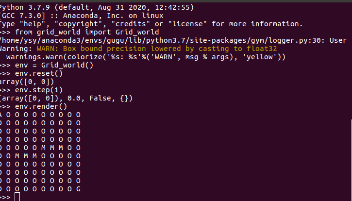
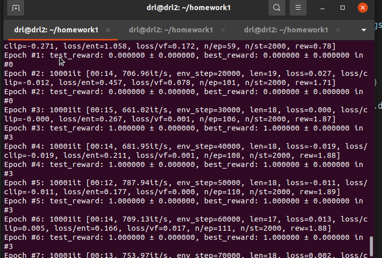

# 任务介绍
AI研究员强化学习作业
设计一个10x10的GridWorld，其中有一个Agent出生于(0, 0)点，而在（9，9）点中有一面红旗，该Agent的目标是尽快取到红旗完成游戏。地图上还散落着一些地雷，分别在(4,5), (4, 6), (4, 7), (5, 2), (5, 3), (5, 4)上，当Agent踩到地雷时会触发地雷爆炸导致Agent死亡，游戏结束。Agent可以进行4个方向的移动：上、下、左、右。
# 文件说明
```
grid_world.py ------ 环境文件
rp.py         ------ 环境wrapper文件
test_ppo.py   ------ ppo算法，调用天授
```
## 环境使用说明

运行该环境只需要安装gym与numpy
安装后可以直接进行测试
本作业实现了以上任务，并使用命令行进行渲染显示，其中地雷为M、红旗为G、Agent用A表示、起点用S表示、其他区域使用O表示
```
python
from grid_world import Grid_world
env = Grid_world()
env.reset()
env.step(1)
env.render()
```


## 任务建模
因为任务是固定地图，所以我们只需要将当前智能体位置作为状态空间即可。
动作即智能体向上下左右移动

奖励函数
本文先尝试了使用最简单的奖励函数，到达目标点给1奖励碰撞给-1奖励，很遗憾，这个奖励没有收敛，智能体会直接不动。
之后本文对正向奖励做了奖励塑造，靠近目标时给正向奖励远离给负的奖励。任务很快可以收敛到最优。
之后本文对修改了奖励，给每一步一些惩罚，任务也可以正常收敛。

图中test_reward没有做奖励塑造，当其等于1代表任务完成。
## 运行方式
- 安装相应依赖
```
python test
```
